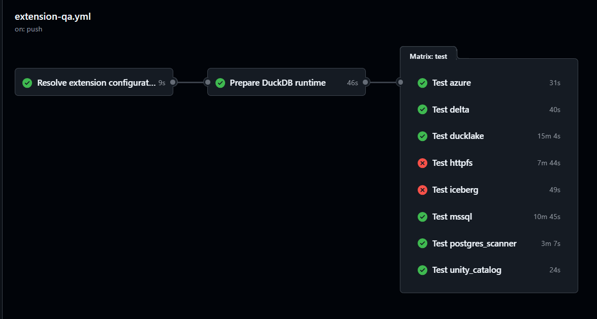

# Presentazione SAL: validazione DuckDB ed estensioni

---

## Titolo

# Processo di validazione DuckDB ed estensioni

Esigenza, processo proposto, risultati del POC e scelta della piattaforma di esecuzione.

Contesto:

- DuckDB viene utilizzato nell'Analytics Engine insieme a un insieme di estensioni;
- tramite un POC abbiamo verificato la fattibilità tecnica del processo;
- il SAL deve valutare se il processo è soddisfacente e dove deve essere eseguito stabilmente.

---

## Perché siamo qui

# Perché serve un processo?

- Gli aggiornamenti DuckDB richiedono una validazione ripetibile, non soltanto prove manuali.
- Nel tempo abbiamo provato controlli diversi, ma erano limitati o legati alla singola macchina di sviluppo.
- Build di DuckDB, `unittest`, container e batterie di test possono occupare la postazione per molto tempo.
- Con l'aumento di estensioni, servizi e scenari, l'esecuzione completa può durare ore.
- Serve quindi un processo automatizzato, rieseguibile e spostato su infrastruttura dedicata.

---

## Il problema osservato

# Aggiornare DuckDB non significa aggiornare tutto allo stesso modo

Ogni release DuckDB seleziona specifiche revisioni delle estensioni: una revisione può avanzare, restare invariata o essere semplicemente ricompilata per la nuova versione DuckDB e piattaforma.

La disponibilità del binario e il caricamento corretto non dimostrano che tutti gli scenari funzionali continuino a comportarsi correttamente: la combinazione effettiva deve essere registrata e sottoposta a test.

La compatibilità binaria è un prerequisito; l'esito funzionale deve essere dimostrato dal processo di test.

---

## Il rischio reale: estensioni insieme

# Il rischio nasce dalla composizione

- Un'estensione può buildare per la nuova versione DuckDB senza introdurre modifiche funzionali reali.
- Un'estensione può funzionare isolatamente e fallire quando viene caricata insieme alle altre.
- Possibili collisioni su funzioni, impostazioni, secret provider, filesystem e cataloghi.
- Sequenze di `ATTACH` di cataloghi diversi possono causare problemi (`ad esempio ATTACH MSSQL dopo PostgreSQL - già risolto`)
- Anche l'ordine di caricamento può avere effetti sul comportamento.

---

## Cosa deve fare il processo

# Processo proposto

Il processo deve produrre evidenze su tre livelli:

1. **Preparare un runtime ripetibile**: DuckDB CLI, `unittest`, pin (commit specifico) e set di estensioni della piattaforma.
2. **Verificare le estensioni nel contesto comune**: riusare i test originali dove disponibili, ma con il set di estensioni caricate.
3. **Validare la composizione**: aggiungere scenari cross-extension mantenuti da noi e farli crescere quando ci sono regressioni o bug.

Output atteso:

- report di compatibilità;
- test falliti, esclusi o non eseguibili;
- problemi noti e rischi residui;
- evidenze per decidere se l'aggiornamento è accettabile.

---

## Cosa abbiamo ottenuto con il POC

# POC su GitHub Actions

Realizzato:

Perché GitHub:

- rapidità di realizzazione del POC;
- runner Ubuntu già disponibili;
- gestione semplice di job, container, artifact e log;
- repository DuckDB ed estensioni già presenti sulla piattaforma.

---

## Perimetro delle estensioni

# Set di estensioni di piattaforma da validare

Il runtime di validazione deve caricare il set di estensioni utilizzato dalla piattaforma:

> Delta; DuckLake; HTTPFS; Iceberg; PostgreSQL Scanner; Azure; Unity Catalog; MSSQL; Virtual File Provider; BigQuery.

Stato del POC:

- sono già configurate batterie per HTTPFS, DuckLake, PostgreSQL Scanner, Delta, Iceberg, Azure, Unity Catalog e MSSQL;
- Virtual File Provider e BigQuery devono essere integrati nel processo;
- non tutte le estensioni richiedono una batteria dedicata: alcune devono essere caricate e verificate soprattutto nei test congiunti (ICU).

---

## Cosa manca

# Da POC a processo ufficiale

Da completare:

- test cross-extension in una singola sessione;
- integrazione Virtual File Provider e BigQuery;
- report aggregato per il SAL;
- misurazione tempi, dimensione artifact e log;
- classificazione test esclusi, parziali o non eseguibili;
- accesso a piattaforme reali per i test oggi coperti solo in parte;
- spike Telemaco DevOps;
- decisione sulla piattaforma stabile.

Nota sui test parziali:

- alcune batterie, come Iceberg, Delta/Unity Catalog e HTTPFS, possono eseguire solo una parte dei test senza account o servizi esterni;
- MinIO copre scenari S3-like locali, ma non sostituisce completamente un provider cloud S3 reale;
- per completare la validazione serviranno credenziali, account o ambienti dedicati sulle piattaforme per cui le estensioni sono state create.

---

## Dove far girare il processo?

# GitHub o Telemaco DevOps?

La domanda successiva è organizzativa e infrastrutturale.

Opzioni principali:

- continuare su GitHub Actions;
- portare il processo su Telemaco DevOps.

Valutato e scartato:

- GitHub Actions con runner self-hosted Irion.

---

## GitHub Actions

# GitHub: veloce e già dimostrato

Vantaggi:

- POC già funzionante;
- runner pronti ed effimeri;
- job paralleli semplici;
- artifact e log immediati;
- repository DuckDB già su GitHub;
- ideale per iterare velocemente.

Criticità:

- repository private con quote o costi;
- log e artifact fuori dalla rete Irion;
- Virtual File Provider interna non accessibile dai runner hosted;
- governance esterna.

---

## Telemaco DevOps

# Telemaco DevOps: interno ma da verificare

Vantaggi:

- resta nella rete Irion;
- accesso ai repository interni;
- accesso al repository interno del Virtual File Provider e ai log associati;
- controllo su log, retention e processo ufficiale;
- coerente con un processo aziendale interno.

Criticità:

- macchine runner da predisporre;
- Docker e Docker Compose da verificare;
- container Linux per build e test della prima fase;
- container e rete aziendale;
- IP, proxy e firewall;
- parallelizzazione da provare;
- adattamento del workflow rispetto al POC GitHub.

---

## Container, rete, Virtual File Provider, ambienti cloud e copertura Windows

# Container, rete, Virtual File Provider, ambienti cloud e copertura Windows

**Punto tecnico da chiarire**

I servizi locali dei test saranno eseguiti tramite container della pipeline. Sulle macchine runner bisogna verificare:

- esecuzione dei container Linux di test;
- accesso alla rete aziendale dai container;
- IP registrati o non registrati;
- proxy e firewall;
- porte e nomi container quando più test sono eseguiti;
- agenti persistenti o effimeri;
- modalità di isolamento tra esecuzioni.

**Virtual File Provider**

Il repository interno condiziona la scelta:

- repository Virtual File Provider oggi interno;
- non raggiungibile dai runner GitHub-hosted;
- necessario per una validazione completa del set di piattaforma.

Opzioni realistiche:

1. portare o replicare il repository su GitHub private;
2. usare Telemaco DevOps end-to-end.

**Servizi cloud necessari per completare i test**

I servizi locali/emulati sono gestiti dai container della pipeline. Questa lista riporta solo gli account o provider cloud necessari quando la batteria richiede una piattaforma reale.

- **BigQuery**: progetto Google Cloud, dataset BigQuery dedicato e service account con credenziali.
- **Azure / Delta**: Azure Blob Storage, ADLS Gen2 e service principal/access token per test cloud e ABFSS.
- **Unity Catalog**: workspace Databricks con Unity Catalog, token/service principal, catalogo e schema di test.
- **Iceberg cloud**: AWS Glue, AWS S3 Tables, Cloudflare R2 e Snowflake Open Catalog per la matrice cloud Iceberg.
- **MSSQL cloud**: Azure SQL Database / Microsoft Fabric per il gruppo di test cloud MSSQL.

**Risorse e permessi**

- Bucket, container, cataloghi, schemi e database dedicati, con permessi di lettura, scrittura, lista, cancellazione e cleanup.

**Copertura Windows e perimetro**

- Fase 1: validazione Linux containerizzata, già dimostrata dal POC.
- Fase 2: smoke test e scenari cross-extension Windows nativi.
- I servizi di supporto possono restare in container Linux, ma DuckDB, `unittest` ed estensioni Windows devono essere eseguiti nativamente.
